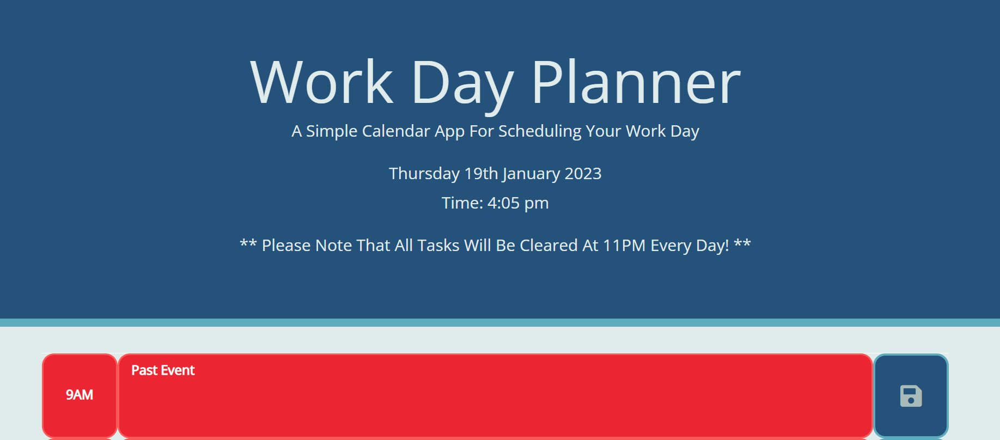
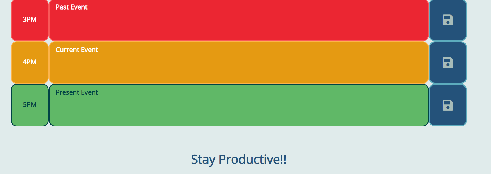

# Work Day Planner

## Description
The motivation behind this challenge was to create a work day planner using jQuery and moment.js so that users could organise their work day. The parameters of this challenge were as follows:
- The program should display the current day at the top of the calendar when a user opens the planner.
- The program should present the user with timeblocks for standard business hours when the user scrolls down.
- The program should colour-code each timeblock on past, present and future when the timeblock is viewed.
- The program should allow a user to enter an event when they click on a timeblock.
- The program should save the event in local storage when the save button is clicked in that timeblock.
- The program should persist events between refreshes of a page.

Throughout working on this challenge, I have learnt the following:
- How to navigate and manipulate the DOM (Document Object Model) using jQuery syntax.
- How to implement third-party APIs such as moment.js.
- Reinforced my knowledge and capabilities in storing and retrieving data from local (client side) storage.

#
## Table Of Contents
- [Usage](#usage)
- [Credits](#credits)
- [Deployment](#deployment)
- [License](#license)

#
## Usage
In order for the program to run, you as the user will need to load the web page. There you will be presented with the current date and time, as well as a series of timeblocks starting at 9AM and ending at 5PM. Depending on what the current time is, the timeblocks will be coloured to highlight whether the time slot is in the past, present or future.

These parameters are coloured as follows:
- Past = RED
- Present = AMBER
- Future = Green

You as the user will then have the capability to enter the tasks of the working day and save them to your local storage by clicking the "Save" button. Regardless of whether the page is refreshed or not, the program will save these tasks and make them visible for you to read. For example:

When the time reaches 11PM, the program will automatically clear the local storage to allow you as the user to have a fresh planner every single day.

#
## Credits
Throughout working on this challenge, I sought the knowledge and advice from multiple sources including:
- https://momentjs.com/
- https://developer.mozilla.org/en-US/docs/Web/HTML/Element/textarea#:~:text=The%20HTML%20element%20represents,a%20review%20or%20feedback%20form
- https://www.w3schools.com/icons/#:~:text=To%20insert%20an%20icon%2C%20add,color%2C%20shadow%2C%20etc.)
- https://palettes.shecodes.io/palettes/1475
- https://www.w3schools.com/jquery/default.asp
- https://www.w3schools.com/jquery/jquery_intro.asp
- https://www.w3schools.com/jquery/jquery_get_started.asp
- https://www.w3schools.com/jquery/jquery_syntax.asp
- https://www.w3schools.com/jquery/jquery_selectors.asp
- https://www.w3schools.com/jquery/jquery_events.asp
- https://www.tutorialspoint.com/momentjs/momentjs_quick_guide.htm
- https://momentjscom.readthedocs.io/en/latest/moment/05-query/01-is-before/
- https://momentjscom.readthedocs.io/en/latest/moment/05-query/02-is-same/
- https://www.w3schools.com/jquery/jquery_css_classes.asp
- https://www.w3schools.com/jquery/jquery_dom_set.asp
- https://stackoverflow.com/questions/7085024/javascript-jquery-undefined-textarea-value
- https://momentjscom.readthedocs.io/en/latest/moment/03-manipulating/04-end-of/
- https://blog.logrocket.com/localstorage-javascript-complete-guide/#:~:text=To%20delete%20local%20storage%20sessions,this%20method%20will%20do%20nothing
- https://stackoverflow.com/questions/56508930/localstorage-breaks-github-page

#
## Deployment
Below is the link to the deployed webpage using GitHub Pages:
- https://maccersm8.github.io/Work-Day-Planner/

#
## License
Copyright (c) 2023 Maisie McDonald

Permission is hereby granted, free of charge, to any person obtaining a copy
of this software and associated documentation files (the "Software"), to deal
in the Software without restriction, including without limitation the rights
to use, copy, modify, merge, publish, distribute, sublicense, and/or sell
copies of the Software, and to permit persons to whom the Software is
furnished to do so, subject to the following conditions:

The above copyright notice and this permission notice shall be included in all
copies or substantial portions of the Software.

THE SOFTWARE IS PROVIDED "AS IS", WITHOUT WARRANTY OF ANY KIND, EXPRESS OR
IMPLIED, INCLUDING BUT NOT LIMITED TO THE WARRANTIES OF MERCHANTABILITY,
FITNESS FOR A PARTICULAR PURPOSE AND NONINFRINGEMENT. IN NO EVENT SHALL THE
AUTHORS OR COPYRIGHT HOLDERS BE LIABLE FOR ANY CLAIM, DAMAGES OR OTHER
LIABILITY, WHETHER IN AN ACTION OF CONTRACT, TORT OR OTHERWISE, ARISING FROM,
OUT OF OR IN CONNECTION WITH THE SOFTWARE OR THE USE OR OTHER DEALINGS IN THE
SOFTWARE.